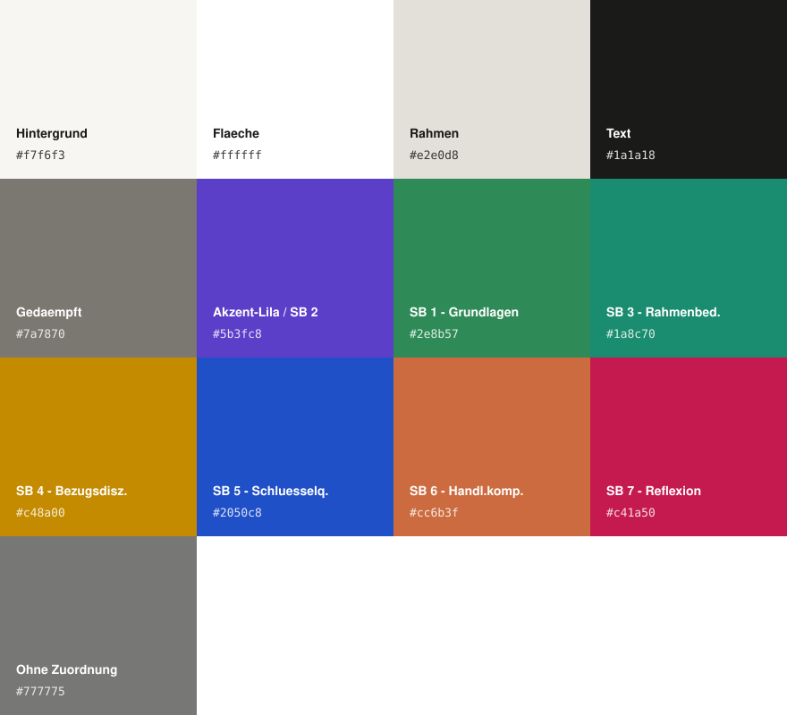

# Modulverzeichnis

Öffentliches, mit anderen Studierenden geteiltes Nachschlagewerk für den Studiengang
B.A. Soziale Arbeit (EH Ludwigsburg) – alle 28 Module mit Bausteinen, Modulprüfungen,
Modulverantwortlichen, Workload-Aufteilung und Voraussetzungen.

🔗 **Live:** https://module.xn--peppermita-lnb.de/

Schwesterprojekt zum privaten [Vorlesungskalender](https://github.com/peppermieta/Kalender) –
eigenständiges Repo, eigene Domain, frei zugänglich ohne Passwortschutz.

## Funktionen

- **Alle 28 Module** des Studiengangs mit Bausteinen (inkl. PL/UPL-Kennzeichnung), Modulprüfung,
  Modulverantwortung, Workload-Aufteilung (Kontaktzeit/Selbststudium/Praxis) und Verwendbarkeit
  in anderen B.A.-Studiengängen
- **Studienverlaufsplan-Grafik** – alle Module nach Semestern (1.–7.) sortiert, farblich nach den
  7 offiziellen Studienbereichen gruppiert (siehe [PALETTE.md](PALETTE.md))
- **Semesterauswahl** – eigenes aktuelles Semester wählen, Module färben sich automatisch nach
  "abgeschlossen / aktuelles Semester / kommend"; Auswahl bleibt lokal gespeichert (kein Server,
  kein Account nötig)
- **Voraussetzungen als klickbare Querverweise** zwischen den Modulen – zeigt auf einen Blick, wie
  Module aufeinander aufbauen
- **Disclaimer** direkt am Seitenanfang: inoffizielle Übersicht, maßgeblich bleibt das offizielle
  Modulhandbuch der EH Ludwigsburg

## Daten pflegen

Alle Moduldaten liegen zentral in `modules_data.py` (Python), aus der `index.html` per
`build.py` generiert wird. Bei Änderungen:

```
python3 build.py
```

erzeugt eine neue `index.html` aus den aktuellen Daten in `modules_data.py`. Nicht direkt in der
generierten `index.html` editieren – Änderungen gehen beim nächsten Build verloren.

## Lizenz & Quelle

Der Quellcode dieser Seite steht unter der [MIT-Lizenz](LICENSE) und darf frei genutzt und
angepasst werden – z. B. als Vorlage für andere Studiengänge oder Jahrgänge.

Die **Inhalte** (Modulnamen, Prüfungsordnungen, Modulverantwortliche etc.) stammen aus dem
Modulhandbuch B.A. Soziale Arbeit der EH Ludwigsburg (Stand 03/2026) und gehören der Hochschule –
davon ist die Lizenz ausdrücklich ausgenommen. Bei Widersprüchen gilt ausschließlich das offizielle
Modulhandbuch.

Fehler gefunden oder Feedback? `info@peppermięta.de`

## Versionshistorie

Alle Änderungen werden in [CHANGELOG.md](CHANGELOG.md) dokumentiert (aktuelle Version: **1.5.0**).

## Farbpalette



Vollständige Werte (Hex, RGB, CMYK, HSB, HSL, Lab) in [PALETTE.md](PALETTE.md).

## Tech-Stack

Reines HTML/CSS/JavaScript, keine Frameworks oder Build-Schritte (außer dem optionalen
Python-Generator für die Moduldaten). Schriftarten: [Inter](https://fonts.google.com/specimen/Inter)
(Fließtext) und [JetBrains Mono](https://www.jetbrains.com/lp/mono/) (Modul-Nummern), beide über
Google Fonts.
